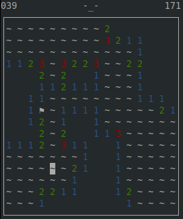

# minesweeper



This game was coded as a simple exercise for using `curses` and `pyinstaller`. The requirements to build binary are
```bash
sudo apt install python3.8 python3.8-venv
```
The project can be built with
```bash
# To build
make
# To remove all build files
make clean
```

To run binary and see the help message:
```bash
./minesweeper -h
# usage: minesweeper [-h] [-d {easy,intermediate,expert}]

# Play Minesweeper game. To navigate use ← → ↑ ↓, to reveal a field press Space, to flag a field use f, to reset the game press r and to quit the game use q.

# optional arguments:
#   -h, --help            show this help message and exit
#   -d {easy,intermediate,expert}, --difficulty {easy,intermediate,expert}
#                         choose difficulty level
```
